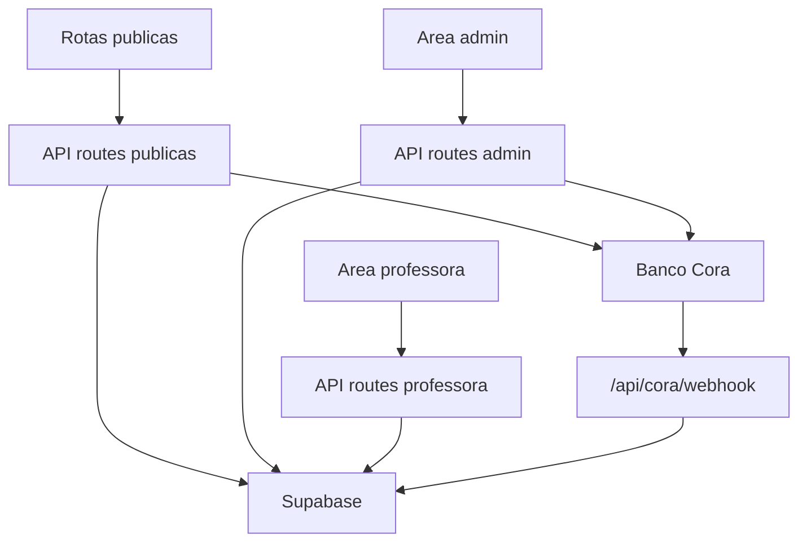

# 01 - Estado Atual

## Produto atual

O sistema e uma PWA de gestao para uma escola/equipe de danca/ginastica, identificada nas telas como "Equipe Carolina Garcia". Ele atende hoje a um unico cliente e combina:

- portal publico para responsaveis;
- backoffice administrativo;
- area operacional de professoras;
- integracao financeira com Banco Cora para PIX;
- persistencia e autenticacao via Supabase.

## Stack detectada

| Camada | Uso atual |
| --- | --- |
| Framework | Next.js `16.0.10` com App Router |
| UI | React `19.2.0`, TypeScript, componentes Radix/shadcn-like |
| Estilo | Tailwind CSS 4, CSS global em `app/globals.css` e `styles/globals.css` |
| Dados/Auth | Supabase SSR e `@supabase/supabase-js` |
| Data fetching client | SWR |
| Formularios/validacao | React Hook Form, Zod instalados, mas grande parte dos forms usa `useState` manual |
| Pagamentos | Banco Cora via mTLS em `lib/cora.ts` |
| PWA/Deploy | Manifest em `public/manifest.json`, Vercel Analytics |

Nao encontrei Vue, Vite ou estrutura Lovable/Vue. O que existe hoje ja e Next/React, mas ainda com organizacao tipica de projeto gerado: paginas grandes, logica de negocio espalhada entre UI, API routes e scripts SQL.

## Estrutura de pastas

| Pasta/arquivo | Papel atual |
| --- | --- |
| `app/` | Rotas Next.js, paginas e API routes |
| `components/layout/` | Headers publico/mobile/server |
| `components/ui/` | Biblioteca de componentes reutilizaveis |
| `hooks/` | Hooks de sessao, mobile e toast |
| `lib/supabase/` | Clients Supabase, helper de proxy/middleware e server actions |
| `lib/supabase/relations.ts` | Normalizacao de relacoes Supabase que podem vir como objeto ou array |
| `lib/cora.ts` | Cliente mTLS/OAuth2 para Banco Cora |
| `lib/types.ts` | Tipos manuais do dominio, parcialmente defasados |
| `lib/mock-data.ts` | Dados mockados legados |
| `scripts/` | Scripts SQL consolidados, RLS, indices, crons e seed |
| `public/` | Logos, icones, manifest e placeholders |

## Personas e acessos

| Persona | Entrada | Permissao principal |
| --- | --- | --- |
| Publico/responsavel | `/cadastro`, `/pagamentos`, `/produtos`, `/eventos` | Consulta e envio de dados publicos |
| Admin | `/admin` | Gestao completa de cadastros, financeiro, cobrancas, produtos, eventos e configuracoes |
| Professora | `/professora` | Ver turmas/alunas vinculadas, fazer chamadas e consultar financeiro proprio |

## Autenticacao e autorizacao

O proxy em `proxy.ts` chama `updateSession` em `lib/supabase/middleware.ts`. Esta migracao acompanha o aviso do Next 16, que depreca a convencao `middleware.ts`.

Se `NEXT_PUBLIC_SUPABASE_URL` ou `NEXT_PUBLIC_SUPABASE_ANON_KEY` estiverem ausentes, o proxy nao derruba paginas publicas como `/login`; rotas protegidas sao redirecionadas para `/login?config=missing-supabase-env`. Isso melhora o desenvolvimento local sem alterar regras de banco.

Fluxo atual:

1. Usuario acessa `/`.
2. Se nao autenticado, e redirecionado para `/login`.
3. Se autenticado, o sistema busca `perfis.papel` e `perfis.ativo`.
4. Admin vai para `/admin`.
5. Professora vai para `/professora`.
6. Admin tentando acessar `/professora` e professora tentando acessar `/admin` sao redirecionados.

Em 2026-06-26 foi criada a fundacao para papeis por tenant via `tenant_memberships`. O proxy passou a reconhecer `owner`, `admin`, `colaborador` e `professora`, mas a migration ainda precisa ser executada e validada no banco de teste.

## Configuracao tecnica atual

Pontos positivos:

- App Router ja separa paginas e API routes por rota.
- Supabase esta centralizado em helpers (`client`, `server`, `admin`, `middleware`/proxy).
- Existe RLS documentado nos scripts SQL.
- O produto ja tem rotas publicas e areas autenticadas separadas.
- A UI e mobile first e bastante orientada a cards/listas, adequada para operacao em celular.
- `next build` agora valida TypeScript de verdade.
- Vitest foi adicionado com testes unitarios iniciais.
- ESLint foi adicionado como baseline de qualidade.

Pontos de atencao:

- O lint ainda possui warnings herdados de componentes/fluxos gerados, principalmente regras novas de React Hooks/Compiler.
- Ha `package-lock.json` e `pnpm-lock.yaml` ao mesmo tempo.
- O diretorio atual nao tem `.git` valido.
- Muitos arquivos de pagina concentram UI, regras, chamadas HTTP e formatadores no mesmo componente.
- O codigo usa bastante `any`.
- Varias rotas server-side usam `createAdminClient()`/service role para bypass de RLS. As principais rotas foram atualizadas com filtro por `tenant_id`; qualquer nova rota com service role deve seguir esse padrao.
- Scripts SQL e codigo parecem divergentes em alguns pontos, detalhados em [04 - Dados e integracoes](./04-dados-e-integracoes.md).

## Leitura arquitetural

Hoje o sistema funciona como um monolito Next.js com tres zonas:

Para virar SaaS, a maior mudanca nao e "trocar Vue por React" porque React ja esta aqui. A mudanca real e separar dominio, dados, permissoes, configuracoes, billing e operacao por tenant. A primeira fundacao disso esta registrada em [09 - Fundacao multi-tenant](./09-multi-tenant.md).
