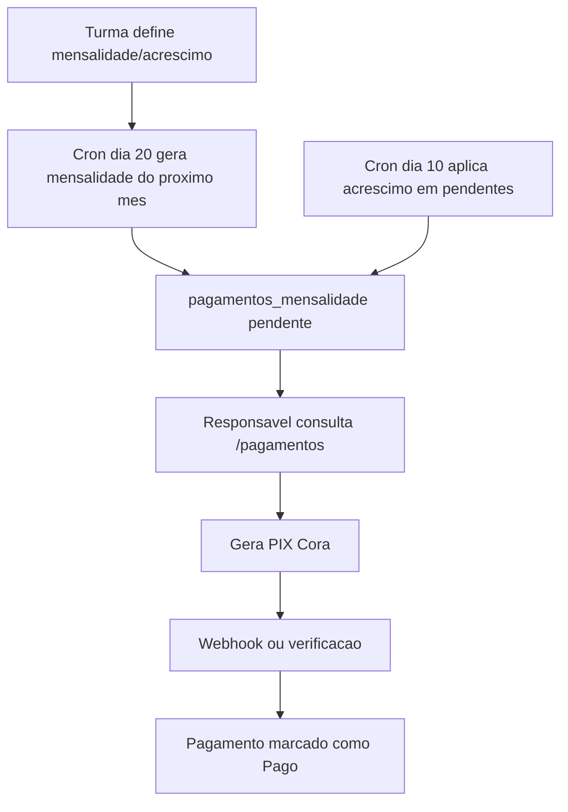
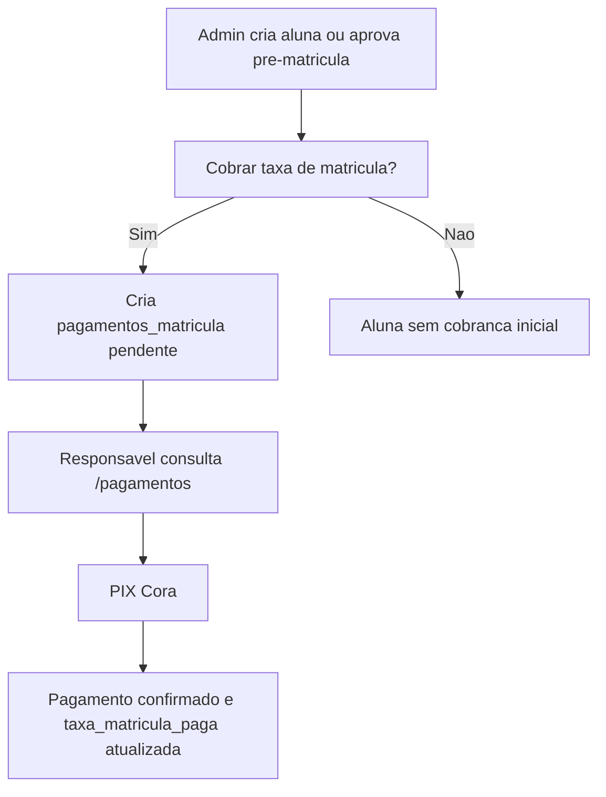
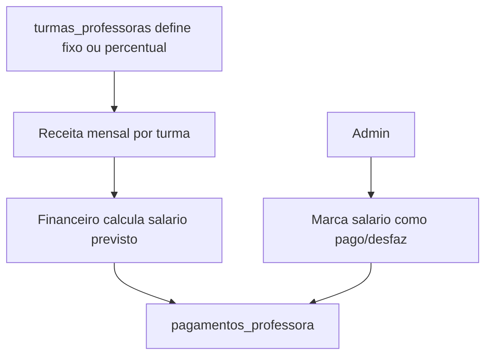

# 02 - Modulos e Fluxos

Este documento lista os modulos funcionais existentes hoje e os fluxos principais observados no codigo.

## Mapa geral

| Area | Modulos |
| --- | --- |
| Publico | Pre-matricula, portal de pagamentos, eventos, vitrine de produtos |
| Admin | Dashboard, polos, locais, turmas, alunas, pre-matriculas, professoras, financeiro, cobrancas, produtos, eventos, configuracoes |
| Professora | Dashboard, minhas turmas, minhas alunas, chamadas, financeiro |
| Infra | Auth/RLS Supabase, Cora PIX, crons financeiros, PWA |

## Area publica

### Pre-matricula

Rota: `/cadastro`

Fluxo:

1. Responsavel preenche dados da aluna.
2. Responsavel preenche dados pessoais e contato.
3. Responsavel preenche endereco.
4. Front envia POST para `/api/admin/pre-matriculas`.
5. Registro fica com status `pendente`.
6. Admin ve em `/admin/alunas`, aba "Pre-Matriculas".
7. Admin pode aprovar e selecionar turma.
8. A aprovacao converte a pre-matricula em aluna, cria/atualiza responsavel e opcionalmente gera cobranca de matricula.

### Portal de pagamentos

Rota: `/pagamentos`

Fluxo:

1. Responsavel informa CPF da aluna.
2. Front consulta `/api/pagamentos/buscar-cpf`.
3. Sistema lista mensalidades e taxa de matricula.
4. Responsavel gera PIX individual ou agrupado.
5. Front chama `/api/cora/criar-pix`.
6. API cria invoice na Cora e salva `txid_cora`/status no pagamento.
7. Tela mostra QR Code, copia e cola e link de pagamento.
8. Status e atualizado por:
   - polling da propria pagina via `/api/pagamentos/verificar`;
   - webhook Cora em `/api/cora/webhook`;
   - cron global planejado nos scripts.

### Eventos publicos

Rota: `/eventos`

Fluxo:

1. Publico lista eventos via `/api/public/eventos`.
2. Responsavel seleciona evento ativo.
3. Informa CPF da aluna.
4. API `/api/public/eventos/{id}/inscrever` valida aluna e evita duplicidade.
5. Registro e criado em `inscricoes_evento`.
6. Se houver taxa, a tela informa pagamento junto a equipe. Nao ha fluxo PIX automatico para evento no codigo atual.

### Vitrine publica de produtos

Rota: `/produtos`

Fluxo:

1. Publico lista produtos disponiveis via `/api/public/produtos`.
2. Produtos exibem nome, descricao, valor, categoria e tamanhos.
3. Configuracao de WhatsApp admin e usada como contato.
4. Nao ha carrinho nem checkout de produto no codigo atual.

## Area admin

### Dashboard admin

Rota: `/admin`

Funcao:

- Mostra indicadores de alunas ativas, professoras, polos, locais, total pendente e alunas com atraso.
- Oferece atalhos para os principais modulos.
- Usa `/api/admin/stats`.

### Polos

Rotas:

- `/admin/polos`
- `/admin/polos/{id}`

Funcao:

- Cadastro de polos/unidades macro.
- Cada polo possui locais vinculados.
- Tela lista, busca, cria, edita, exclui e abre detalhe.

### Locais

Rotas:

- `/admin/locais`
- `/admin/locais/{id}`

Funcao:

- Cadastro de locais fisicos vinculados a polos.
- Locais podem ter turmas.
- Tela filtra por polo e permite CRUD.

### Turmas

Rotas:

- `/admin/turmas`
- `/admin/turmas/{id}`

Funcao:

- Cadastro e gestao de turmas.
- Campos principais: polo, local, nivel, faixa etaria, mensalidade, acrescimo apos dia 10, taxa de matricula e ativo.
- Turma possui horarios.
- Turma possui professoras vinculadas com tipo de pagamento fixo ou percentual.
- Turma possui custos fixos ou percentuais por categoria.
- Detalhe mostra horarios, professoras e alunas.

Fluxo de criacao/edicao:

1. Admin seleciona polo e local.
2. Informa dados financeiros e pedagogicos.
3. Adiciona horarios.
4. Vincula professoras e regra de remuneracao.
5. Adiciona custos da turma.
6. API grava turma e tabelas dependentes.

### Alunas e pre-matriculas

Rotas:

- `/admin/alunas`
- `/admin/alunas/{id}`

Funcao:

- Tela com duas abas: alunas e pre-matriculas.
- Alunas podem ser filtradas por busca, polo, local, turma e status financeiro.
- Admin cria, edita, exclui e abre ficha.
- Cadastro inclui responsavel, endereco, desconto e geracao opcional de cobranca de matricula.
- Pre-matriculas podem ser visualizadas, reprovadas ou convertidas em alunas.

### Professoras

Rotas:

- `/admin/professoras`
- `/admin/professoras/{id}`

Funcao:

- Lista professoras do Supabase Auth/perfis.
- Admin cria usuaria professora com e-mail e senha inicial.
- Admin edita nome.
- Exclusao atual desativa o perfil, nao remove fisicamente.
- Vinculo com turmas acontece principalmente no modulo de turmas.

### Financeiro

Rota: `/admin/financeiro`

Abas:

- Mensalidades
- Matriculas
- Custos
- Salarios

Funcao:

- Filtra por mes, polo, local e turma.
- Mostra esperado, recebido, pendente e saldo liquido.
- Calcula visoes por turma/categoria/professora.
- Permite marcar/desmarcar salario de professora como pago.

### Cobrancas

Rota: `/admin/cobrancas`

Funcao:

- Lista alunas com mensalidades pendentes.
- Filtra por polo, local, turma e busca.
- Permite selecionar uma ou varias alunas.
- Gera mensagens de cobranca via WhatsApp (`wa.me`) com meses pendentes e total.
- Nao ha automacao interna de envio. A acao abre o WhatsApp.

### Produtos

Rota: `/admin/produtos`

Funcao:

- Catalogo administrativo de produtos/uniformes.
- Lista total, disponiveis e indisponiveis.
- Filtra por nome, categoria e disponibilidade.
- Cria, edita, exclui e ativa/desativa produto.
- Linka para vitrine publica `/produtos`.

### Eventos

Rotas:

- `/admin/eventos`
- `/admin/eventos/{id}`

Funcao:

- Cria, edita e exclui eventos.
- Separa proximos e passados.
- Detalhe mostra inscricoes.
- Inscricoes podem ter status de pagamento via campo `pago`, mas nao ha checkout publico de eventos.

### Configuracoes

Rota: `/admin/configuracoes`

Funcao:

- Configura status da integracao Cora.
- Mostra URL de webhook esperada.
- Testa conexao Cora via `/api/cora/testar-conexao`.
- Configura WhatsApp administrativo.
- Exibe links publicos relevantes: pagamentos, produtos, pre-matricula e eventos.

## Area professora

### Dashboard professora

Rota: `/professora`

Funcao:

- Valida sessao e perfil no servidor.
- Mostra boas-vindas, quantidade de turmas e alunas vinculadas.
- Atalho para chamadas do dia.
- Lista turmas da professora.

### Minhas turmas

Rotas:

- `/professora/turmas`
- `/professora/turmas/{id}`

Funcao:

- Lista turmas vinculadas a professora autenticada.
- Detalhe mostra dados da turma, horarios, alunas e situacao financeira resumida.

### Minhas alunas

Rotas:

- `/professora/alunas`
- `/professora/alunas/{id}`

Funcao:

- Lista alunas das turmas da professora.
- Detalhe permite consultar ficha, turma e historico relevante.
- A professora nao tem CRUD amplo de alunas.

### Chamadas

Rota: `/professora/chamadas`

Fluxo:

1. Sistema busca horarios de hoje da professora.
2. Professora inicia chamada de uma turma/horario.
3. Todas as alunas comecam como presentes.
4. Cada toque alterna `presente`, `ausente`, `justificada`.
5. Ausencias/justificativas podem ter observacao.
6. Professora encerra chamada.
7. API salva `chamadas` e `presencas`.
8. Historico pode ser filtrado por turma.

### Financeiro professora

Rota: `/professora/financeiro`

Funcao esperada pelo nome/estrutura:

- Visao financeira da professora autenticada.
- Deve se apoiar em `pagamentos_professora` e vinculos de turma.
- Precisa ser revisada com detalhes quando formos mexer nesse modulo.

## Fluxos transversais

### Mensalidade

### Matricula

### Remuneracao de professoras

