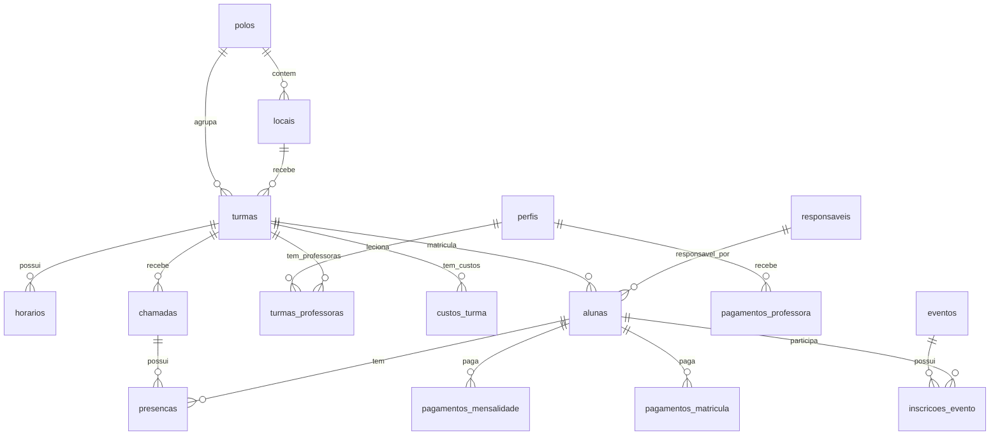

# 04 - Dados e Integracoes

Este documento registra o estado do schema e das integracoes. A partir de 2026-06-26 o projeto possui migrations versionadas para fundacao multi-tenant, configuracao Cora por tenant e onboarding publico de contas SaaS. Codex cria migrations, mas nao executa nada no banco.

## Scripts SQL existentes

| Arquivo | Conteudo |
| --- | --- |
| `scripts/schema_tabelas.sql` | Tabelas principais do dominio |
| `scripts/schema_rls.sql` | Row Level Security e policies |
| `scripts/schema_indexes.sql` | Indices |
| `scripts/schema_funcoes_triggers.sql` | Funcoes SQL e trigger de perfil |
| `scripts/schema_crons.sql` | Regras de negocio financeiras para crons |
| `scripts/006_seed_dados_teste.sql` | Dados de teste |

## Migrations versionadas

| Arquivo | Status | Objetivo |
| --- | --- | --- |
| `scripts/migrations/20260626_0001_multi_tenant_foundation.sql` | Executada no banco de teste segundo usuario; isolamento validado por teste real | Criar `tenants`, `tenant_memberships`, adicionar `tenant_id`, backfillar tenant legado, recriar RLS tenant-aware e bloquear referencias cross-tenant |
| `scripts/migrations/20260626_0002_tenant_cora_config.sql` | Executada no banco de teste segundo usuario | Criar configuracoes/credenciais Cora por tenant |
| `scripts/migrations/20260626_0003_account_signup_onboarding.sql` | Criada, pendente de execucao pelo usuario | Suportar cadastro publico de nova conta SaaS com tenant pendente e ativacao apos confirmacao de e-mail |
| `scripts/migrations/20260627_0004_fix_auth_profile_onboarding_trigger.sql` | Criada, pendente de execucao pelo usuario | Garantir trigger `auth.users -> perfis/tenant_memberships` e corrigir contas SaaS ja criadas sem perfil |

Regra: toda mudanca futura de banco deve entrar como nova migration em `scripts/migrations/` e este documento deve ser atualizado junto.

## Dominios de dados

### Estrutura operacional

| Tabela | Papel |
| --- | --- |
| `polos` | Unidades/regioes macro |
| `locais` | Locais fisicos vinculados a polos |
| `turmas` | Turmas com valores, nivel, idade alvo, polo e local |
| `horarios` | Horarios das turmas |
| `turmas_professoras` | Vinculo N:N entre turmas e professoras, com regra de pagamento |

### Pessoas

| Tabela | Papel |
| --- | --- |
| `perfis` | Espelho de `auth.users`, com `papel` e `ativo` |
| `tenant_memberships` | Vinculo usuario x tenant, com role e status por tenant |
| `tenant_account_signups` | Registro de onboarding publico de novas contas SaaS |
| `responsaveis` | Pais/responsaveis financeiros |
| `alunas` | Alunas, turma, desconto e responsavel |
| `pre_matriculas` | Leads/pre-cadastros externos |

### Presenca

| Tabela | Papel |
| --- | --- |
| `chamadas` | Uma chamada por turma/professora/horario/data |
| `presencas` | Status de presenca por aluna em cada chamada |

### Financeiro

| Tabela | Papel |
| --- | --- |
| `pagamentos_mensalidade` | Mensalidades por aluna e mes |
| `pagamentos_matricula` | Taxa de matricula |
| `pagamentos_professora` | Pagamentos/salarios de professoras |
| `custos_turma` | Custos recorrentes por turma |
| `custos_turma_historico` | Snapshot/calculo mensal dos custos |
| `blocos_cobranca` | Legado, mantido por historico |

### Comercial e configuracao

| Tabela | Papel |
| --- | --- |
| `produtos` | Produtos/uniformes/material |
| `eventos` | Eventos/competicoes |
| `inscricoes_evento` | Inscricoes de alunas em eventos |
| `configuracoes` | Configuracoes do sistema |
| `tenant_cora_configuracoes` | Credenciais, ambiente, webhook e status da integracao Cora por tenant |

## Relacionamentos principais

## RLS e permissoes

Antes da migration multi-tenant, os scripts habilitavam RLS por papel global.

Resumo:

- `eh_admin()` libera operacoes administrativas.
- `eh_professora()` identifica professoras ativas.
- Professoras podem ler turmas/alunas/horarios/presencas vinculados a elas.
- Admin pode operar cadastros, financeiro, produtos, eventos e configuracoes.
- Algumas tabelas permitem leitura publica (`polos`, `locais`, `produtos`, pagamentos e responsaveis, segundo o script).
- `pre_matriculas` permite insert publico.

Com a migration `20260626_0001_multi_tenant_foundation.sql`, as policies passam a considerar `tenant_id`, `tenant_memberships` e funcoes auxiliares como `can_manage_tenant()` e `is_tenant_member()`.

Decisao importante: service role bypassa RLS. Por isso as rotas que usam admin client tambem precisam filtrar `tenant_id` na aplicacao.

## Funcoes e triggers

| Nome | Papel |
| --- | --- |
| `default_tenant_id()` | Retorna o tenant legado usado no backfill inicial |
| `current_tenant_id()` | Resolve tenant pelo claim, membership ou tenant legado |
| `tenant_role()` | Retorna role do usuario autenticado em um tenant |
| `is_tenant_member()` | Verifica membership ativo no tenant |
| `can_manage_tenant()` | Verifica roles administrativas por tenant |
| `can_teach_tenant()` | Verifica role professora por tenant |
| `enforce_same_tenant_uuid_fk()` | Trigger generico contra relacionamento entre tenants diferentes |
| `eh_admin()` | Verifica perfil admin ativo |
| `eh_professora()` | Verifica perfil professora ativo |
| `calcular_salario_professora()` | Calculo legado/simples de salario por mes |
| `calcular_valor_mensalidade()` | Legado baseado em `blocos_cobranca` |
| `handle_novo_usuario()` | Cria perfil/membership ao inserir usuario em `auth.users`; onboarding SaaS entra como inativo/convidado ate confirmacao de e-mail |
| `on_auth_user_created` | Trigger que chama `handle_novo_usuario()` |

## Crons financeiros documentados

| Cron | Quando | Objetivo |
| --- | --- | --- |
| 1 | Dia 10, 06:00 BRT | Aplicar acrescimo em mensalidades pendentes do mes |
| 2 | Dia 20, 06:00 BRT | Gerar mensalidades do proximo mes |
| 3 | Dia 20, 07:00 BRT | Lancar salarios/custos fixos |
| 4 | Dia 20, 07:15 BRT | Calcular salarios percentuais |
| 5 | Dia 20, 07:30 BRT | Calcular custos percentuais |
| 6 | A cada 10 min | Verificar/sincronizar PIX pendentes na Cora |

O codigo atual tambem faz verificacao de PIX pela pagina `/pagamentos` e pelo webhook `/api/cora/webhook`.

## Integracoes

### Supabase

Variaveis usadas:

- `NEXT_PUBLIC_SUPABASE_URL`
- `NEXT_PUBLIC_SUPABASE_ANON_KEY`
- `SUPABASE_SERVICE_ROLE_KEY`
- `NEXT_PUBLIC_APP_URL`

Uso atual:

- Auth com Supabase.
- Client server-side em rotas e paginas.
- Admin client para operacoes privilegiadas.
- RLS documentado nos scripts.
- Confirmacao de e-mail para `/criar-conta` usando callback `/auth/confirm`.
- Reenvio de confirmacao e recuperacao/redefinicao de senha usando Supabase Auth e o mesmo callback `/auth/confirm`.
- Troca de senha logada em `/admin/conta`, validando a senha atual antes de atualizar.

Configuracao externa obrigatoria no Supabase Auth:

- habilitar Confirm email;
- adicionar a URL da Vercel em Site URL;
- adicionar `https://seu-dominio.vercel.app/auth/confirm` em Redirect URLs para confirmacao e recuperacao de senha;
- manter tambem a URL local apenas quando for testar localmente.

### Banco Cora

Variaveis usadas:

- `CORA_CLIENT_ID`
- `CORA_PRIVATE_KEY`
- `CORA_CERTIFICATE`

Arquivos/rotas:

- `lib/cora.ts`
- `/api/cora/criar-pix`
- `/api/cora/webhook`
- `/api/cora/testar-conexao`
- `/api/pagamentos/verificar`
- `/api/pagamentos/pix`

Uso atual:

- Autenticacao OAuth2 com mTLS.
- Criacao de invoice PIX.
- Consulta/cancelamento de cobranca.
- Sincronizacao de status para mensalidade e matricula.

Atualizacao SaaS em 2026-06-26:

- foi criada a tabela `tenant_cora_configuracoes`;
- a aplicacao passou a buscar credenciais Cora por `tenant_id`;
- as variaveis `CORA_CLIENT_ID`, `CORA_PRIVATE_KEY` e `CORA_CERTIFICATE` ficam apenas como fallback legado de baixo nivel;
- a tela `/admin/configuracoes` salva client id, chave privada, certificado, webhook, ambiente e status por tenant;
- rotas Cora/pagamentos passaram a filtrar `tenant_id`;
- testes automatizados nao chamam Cora real.

## Divergencias entre scripts e codigo

Estas divergencias nao foram corrigidas agora. Elas indicam que os scripts podem estar atrasados em relacao ao banco real ou que o codigo espera colunas ainda nao refletidas nos scripts.

| Area | Script SQL | Codigo atual |
| --- | --- | --- |
| `produtos` | `preco`, `estoque`, `ativo` | `valor`, `categoria`, `tamanhos`, `disponivel` |
| `configuracoes` | `chave`, `valor` | `cora_webhook_url`, `cora_ativo`, `whatsapp_admin`, consulta por `id = 1` |
| `pre_matriculas` | poucos campos e status `Pendente`, `Convertida`, `Cancelada` | campos completos de CPF, nascimento, endereco, observacoes e status `pendente`, `aprovada`, `recusada` |
| `presencas.status` | comentario cita `presente`, `faltou`, `justificada` | UI/API usam `presente`, `ausente`, `justificada` |
| `perfis` | nao mostra `email` no script | codigo consulta/insere `email` em algumas rotas/actions |

Antes de novas migrations, precisamos manter o schema real do Supabase e os documentos alinhados como fonte de verdade operacional.

## Estado multi-tenant apos a migration criada

Quando a migration for executada no banco de teste:

- todas as tabelas de dominio listadas em [09 - Fundacao multi-tenant](./09-multi-tenant.md) passam a ter `tenant_id`;
- `configuracoes` passa a ser singleton por tenant via chave `(tenant_id, id)`;
- unicidades de CPF, username, pagamentos e inscricoes passam a ser por tenant;
- RLS passa a isolar por tenant;
- triggers passam a bloquear vinculos cross-tenant;
- o cliente atual vira tenant legado `ecg`.

Lacunas restantes:

- apos rodar `20260627_0004_fix_auth_profile_onboarding_trigger.sql`, testar login da conta criada que ficou sem `perfis`;
- crons financeiros globais devem continuar iterando por tenant e exigir `CRON_SECRET`;
- `perfis` ainda representa o perfil default do usuario; o vinculo SaaS real fica em `tenant_memberships`;
- falta teste integrado com mocks da Cora, sem chamada externa real.
