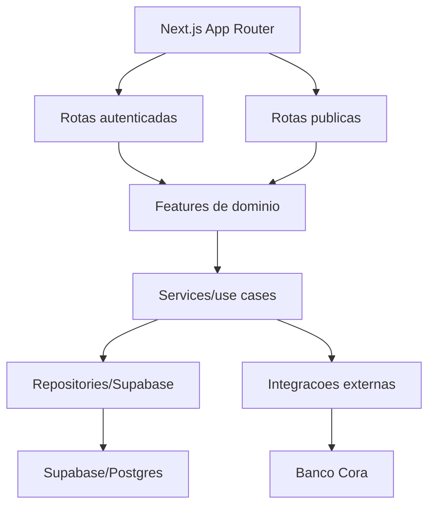

# 05 - Direcao SaaS

Este documento define a direcao de evolucao. Em 2026-06-26 a fase de fundacao multi-tenant foi iniciada com migrations versionadas, ajustes de aplicacao e teste real de isolamento entre tenants.

## Decisao inicial

Como a base ja e Next.js/React, a prioridade nao deve ser "migrar de Vue para React". A prioridade deve ser:

1. estabilizar a base Next/React atual;
2. separar dominio, UI, dados e regras de negocio;
3. criar versionamento, testes e padrao de migrations;
4. evoluir o modelo multi-tenant em etapas pequenas, testaveis e versionadas.

## Objetivo arquitetural

Transformar o monolito gerado em um monolito modular SaaS-ready:



## Organizacao alvo de codigo

Estrutura sugerida para evolucao gradual:

```txt
app/
  (public)/
  (auth)/
  (admin)/
  (professora)/
  api/
components/
  ui/
  layout/
features/
  alunas/
  turmas/
  professoras/
  financeiro/
  pagamentos/
  chamadas/
  eventos/
  produtos/
  locais/
  configuracoes/
shared/
  auth/
  db/
  env/
  http/
  validation/
  formatting/
integrations/
  cora/
tests/
  unit/
  integration/
  e2e/
docs/
```

Nao precisamos mover tudo de uma vez. Cada proxima feature pode nascer no padrao novo, e os modulos antigos podem ser migrados por prioridade.

## Fases recomendadas

### Fase 0 - Base de governanca

- Inicializar Git no projeto. Ainda pendente: existe pasta `.git`, mas `git status` informa que nao e repositorio valido.
- Definir estrategia de branch/commit. Ainda pendente.
- Remover ambiguidade de package manager: escolher npm ou pnpm. Parcial: esta rodada usou npm e atualizou `package-lock.json`; `pnpm-lock.yaml` ainda existe.
- Ativar checagem de TypeScript no build. Concluido em 2026-06-24.
- Adicionar testes unitarios e integrados. Parcial: Vitest e testes unitarios iniciais adicionados em 2026-06-24.
- Criar uma fonte de verdade para schema/migrations.
- Validar encoding UTF-8.

### Fase 1 - Estabilizacao da stack atual

- Manter Next.js/React.
- Padronizar rotas publicas, admin e professora.
- Extrair chamadas de API e regras de negocio de componentes grandes.
- Centralizar formatadores, mascaras e validacoes.
- Trocar `any` por tipos derivados do banco ou DTOs.
- Criar camada de validacao com Zod nas entradas de API.
- Padronizar respostas de erro.

### Fase 2 - Dominio e contratos

Criar contratos claros para:

- Aluna
- Responsavel
- Pre-matricula
- Turma
- Polo/Local
- Professora
- Pagamento
- Cobranca
- Evento
- Produto
- Chamada/Presenca
- Configuracao

Cada dominio deve ter:

- tipos;
- schema de input;
- service/use case;
- repository;
- testes unitarios;
- testes integrados para API routes principais.

### Fase 3 - Fundacao multi-tenant

Iniciada em 2026-06-26.

Criado:

- `scripts/migrations/20260626_0001_multi_tenant_foundation.sql`;
- `tenants` e `tenant_memberships`;
- `tenant_id` nas tabelas de dominio;
- RLS tenant-aware;
- integridade anti-cross-tenant;
- helper `lib/tenant.ts`;
- rotas principais com filtro explicito por tenant.

Antes de considerar esta fase concluida:

- rodar a migration `20260626_0003_account_signup_onboarding.sql` no banco de teste;
- validar fluxos admin/professora/publicos;
- criar testes integrados para as rotas tenant-aware;
- revisar crons financeiros por tenant;
- adicionar mocks integrados para Cora por tenant.

### Fase 4 - Produto SaaS

Depois do tenant:

- planos e limites;
- billing do proprio SaaS;
- onboarding de cliente;
- convites de usuarios;
- auditoria/logs;
- suporte;
- backups;
- observabilidade;
- painel interno da Prodexy.

## Principios de implementacao

- Mudancas pequenas, revisaveis e testadas.
- Banco so muda com migration versionada.
- Nenhuma regra financeira sem teste.
- Nenhuma rota publica com service role sem validacao rigorosa.
- UI mobile first preservada.
- Componentes compartilhados devem nascer de repeticao real, nao de abstracao prematura.
- Toda feature nova deve ter documentacao minima de fluxo.
- Codex deve orientar tecnicamente e discordar quando uma decisao prejudicar seguranca, manutenibilidade ou escala.

## Proximo alvo recomendado

Depois de rodar a migration `20260626_0003_account_signup_onboarding.sql`, o proximo alvo tecnico deve ser validar os fluxos reais por interface:

1. criar uma nova escolinha pelo fluxo publico `/criar-conta`;
2. confirmar o e-mail pelo link do Supabase;
3. criar usuarios admin/professora dentro de cada tenant em `/admin/usuarios`;
4. inserir dados minimos de polo, turma, aluna e produto por tenant;
5. confirmar pela UI que cada tenant so enxerga os proprios dados;
6. criar mocks integrados para Cora por tenant, sem chamada externa real.

Scripts que tocam Supabase real, como `npm run test:tenant-isolation`, existem apenas para execucao controlada pelo usuario.
